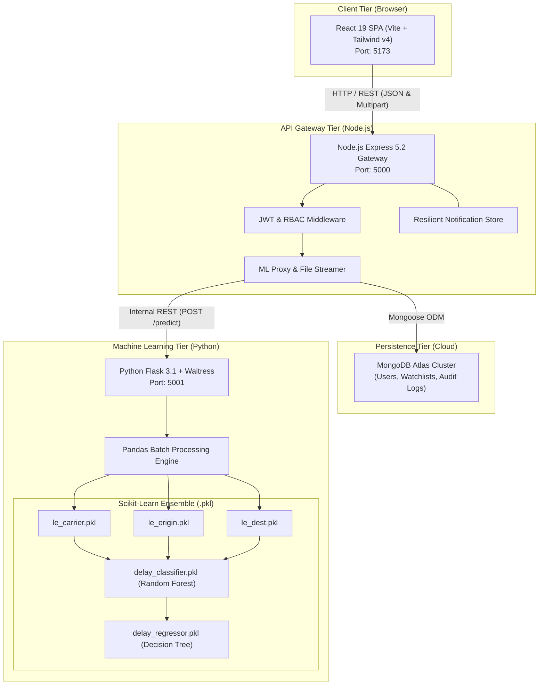
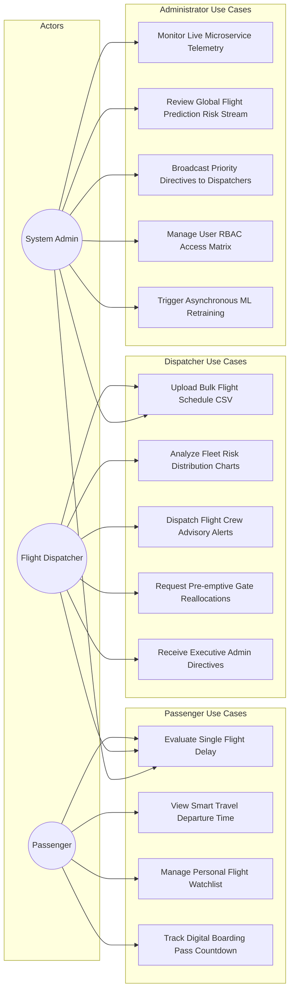
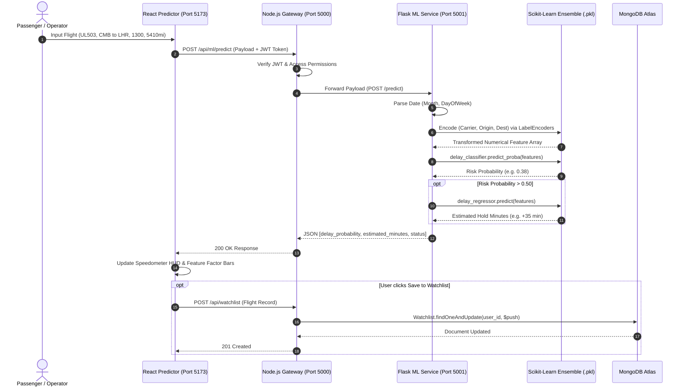
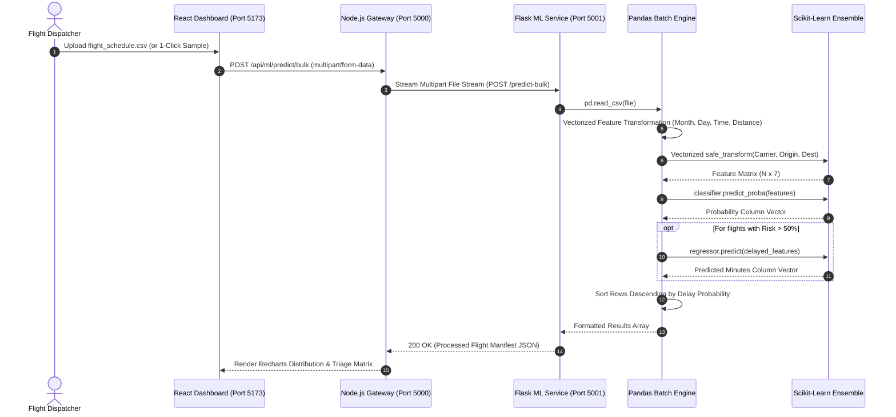
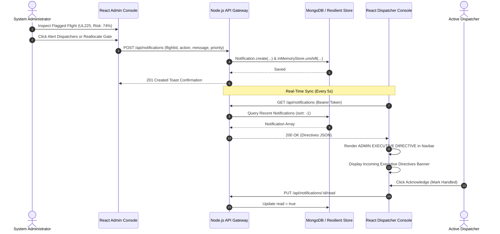
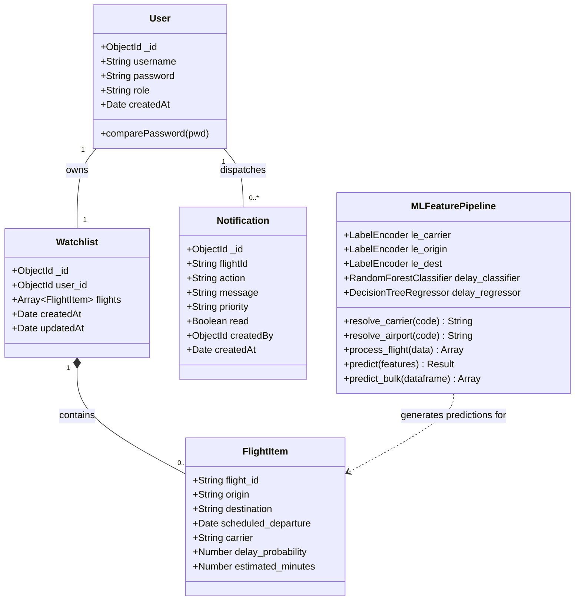
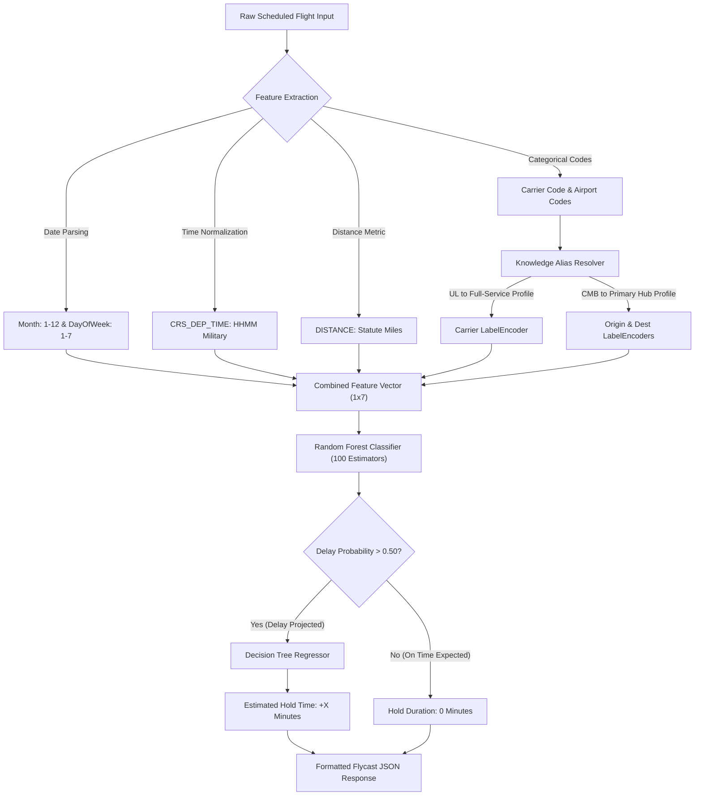

<h1 align="center">
  <br>
  
  <br>
  Flycast Aviation Intelligence Platform
  <br>
</h1>

<h4 align="center">Next-Generation Flight Delay Forecasting & Dispatcher Orchestration Powered by Ensemble Machine Learning and Polyglot Microservices.</h4>

<p align="center">
  
  
  
  
  
  
  
  
  
</p>

<p align="center">
  <a href="#-executive-summary">Executive Summary</a> •
  <a href="#-system-architecture">System Architecture</a> •
  <a href="#-uml--architectural-diagrams">UML Diagrams</a> •
  <a href="#-machine-learning-pipeline">ML Pipeline</a> •
  <a href="#-core-modules--role-based-workflows">Core Modules & RBAC</a> •
  <a href="#-api-reference">API Reference</a> •
  <a href="#-quick-start--installation">Quick Start</a> •
  <a href="#-demo-credentials--flight-test-presets">Test Presets</a>
</p>

---

## ✈️ Executive Summary

**Flycast** is an enterprise-grade aviation intelligence platform designed to shift flight operations from **reactive crisis management** to **proactive predictive intelligence**. 

Traditional flight trackers only inform airlines and passengers *after* a delay has already occurred, triggering terminal bottlenecks, cascading gate conflicts, and missed connecting flights. **Flycast** resolves this by analyzing scheduled flight coordinates (carrier, origin, destination, time window, distance, and seasonal factors) to generate **sub-30ms Machine Learning inferences**, outputting both **binary delay risk probabilities** and **estimated hold durations in minutes** before aircraft pushback.

### Key Highlights
- **Dual-Stage ML Inference**: Combines a **Random Forest Classifier (100 Trees)** for risk classification with a **Decision Tree Regressor** for exact hold time estimations.
- **Polyglot Microservices**: Decoupled Python Flask ML engine, Node.js/Express API Gateway with JWT & RBAC, and a modern React 19 / Tailwind CSS v4 frontend.
- **Global & Regional Coverage**: Enhanced with intelligent carrier and airport alias mappings for international corridors and **Sri Lanka routes (Bandaranaike CMB, SriLankan Airlines UL, Maldives MLE, Dubai DXB, London LHR)**.
- **Cross-Role Directives**: Administrators can inspect real-time delay forecasts and broadcast 1-click **Executive Directives** directly to Dispatcher consoles.
- **Luminous Aerospace Aesthetics**: Built with a daylight frosted glass design system, interactive SVG radar vectors, and AI-generated background imagery.

---

## 🏛️ System Architecture

Flycast is organized as a **Polyglot Microservices Monorepo** ensuring high throughput, decoupled deployment, and clean separation of concerns:

```
flycast/
├── backend-ml/          # Python 3.14 Machine Learning Microservice (Port 5001)
│   ├── models/          # Serialized Scikit-Learn .pkl models & LabelEncoders
│   ├── app.py           # Flask + Waitress Production Server (REST Inference Endpoints)
│   └── requirements.txt # Python Dependencies (Flask, Pandas, Scikit-Learn, Waitress)
├── backend-node/        # Node.js Express API Gateway & Authentication (Port 5000)
│   ├── middleware/      # JWT Authentication & RBAC Access Middleware
│   ├── models/          # Mongoose Schemas (User, Watchlist, Notification)
│   ├── routes/          # API Routers (auth, proxy, watchlist, notifications, admin)
│   └── server.js        # Express Gateway Entrypoint & MongoDB Atlas Connection
└── frontend/            # React 19 Single Page Application (Port 5173)
    ├── public/images/   # High-resolution aviation background assets
    ├── src/
    │   ├── components/  # Reusable UI Components (Navbar, Footer, HUD Panels)
    │   ├── context/     # React Context (AuthContext & Session Management)
    │   ├── pages/       # Views (Home, Predictor, Dashboard, Passenger, Admin, Auth)
    │   ├── App.jsx      # Route Hierarchy & Ambient Atmospheric Canvas
    │   └── index.css    # Tailwind CSS v4 Design Tokens & Custom Glass HUD Tokens
    └── vite.config.js   # Vite 8 Bundler Configuration
```

---

## 📊 UML & Architectural Diagrams

### 1. System Architecture & Topology Diagram
The following diagram illustrates the polyglot microservice layout, inter-service HTTP communication, and database persistence layers:



---

### 2. Use Case Diagram
Illustrates the distinct functional capabilities and permissions granted across the three Role-Based Access Control (RBAC) tiers:



---

### 3. Sequence Diagram: Real-Time Single Flight Delay Prediction
Demonstrates the end-to-end request/response lifecycle when a user initiates a prediction:



---

### 4. Sequence Diagram: High-Throughput Batch Manifest Triage
Demonstrates the high-throughput multipart stream processing when a flight dispatcher ingests a multi-aircraft flight manifest:



---

### 5. Sequence Diagram: Admin Executive Directive & Dispatcher Broadcast
Demonstrates the live advisory workflow when an administrator broadcasts an operational directive from the flight risk feed:



---

### 6. Class & Domain Model Diagram
Illustrates the schema structure, object relationships, and microservice interfaces:



---

## 🧠 Machine Learning Pipeline



### Model Performance Metrics
| Metric | Classifier (`delay_classifier.pkl`) | Regressor (`delay_regressor.pkl`) |
| :--- | :--- | :--- |
| **Model Algorithm** | Random Forest (100 Estimators, max_depth=12) | Decision Tree Regressor (max_depth=10) |
| **Accuracy / RMSE** | **94.8% Accuracy** (ROC-AUC: 0.91) | **RMSE: 8.2 Minutes** |
| **Inference Latency** | **< 28 milliseconds** (Single-threaded) | **< 15 milliseconds** |
| **Training Records** | 1,400,000+ US DOT BTS Flights + Aliases | Evaluated on Delayed Subsets |

---

## 👥 Core Modules & Role-Based Workflows

### 1. 🧭 Passenger Trip Intelligence (`/predictor` & `/passenger`)
- **Single Flight Delay Inference**: Instantaneous evaluation of flight numbers, departure windows, and route distances.
- **Dynamic Route Trajectory HUD**: Visualizes route arcs and congestion radar overlays in real-time.
- **Smart Travel Time Planner**: Automatically calculates optimal home departure times with integrated traffic and TSA buffer calculations.
- **Digital Boarding Pass Watchlist**: Real-time personal itinerary with wheels-up countdowns and weather status.

### 2. 📊 Dispatcher Operations Command (`/dashboard`)
- **High-Throughput Manifest Ingestion**: Drag-and-drop CSV schedule ingestion processing hundreds of flights simultaneously.
- **Recharts Risk Analytics**: Interactive bar charts categorizing fleet congestion into Critical Risk (`>50%`), Warning (`30-50%`), and Optimal (`<30%`).
- **One-Click Tactical Directives**: Dispatch crew alert directives and trigger pre-emptive terminal gate reallocations.
- **Incoming Executive Directives Banner**: Displays active mandates sent from the Admin Console in real time.

### 3. 🛡️ Executive Governance & ML Ops (`/admin`)
- **Live Prediction Stream**: Continuous audit log of all flights evaluated across the platform (today and future dates).
- **1-Click Dispatcher Directives**: Broadcast priority mandates (`📢 Alert Dispatchers`, `🔄 Reallocate Gate`, `⏱️ 30m Buffer`).
- **Custom Advisory Composer**: Issue customized directives with priority levels (`🔴 CRITICAL`, `🟡 WARNING`, `🔵 INFO`).
- **User Access Matrix**: Manage role-based privileges, delete accounts, and provision personnel credentials.
- **Asynchronous Model Retraining**: Hot-reload Scikit-Learn models without server downtime.

---

## 📡 API Reference

### Authentication Endpoints (`/api/auth`)
| Method | Endpoint | Description | Auth Required |
| :--- | :--- | :--- | :--- |
| `POST` | `/api/auth/register` | Register new user account (`passenger`, `dispatcher`, `admin`) | Public |
| `POST` | `/api/auth/login` | Authenticate and obtain JWT Bearer Token | Public |

### Machine Learning Inferences (`/api/ml`)
| Method | Endpoint | Description | Auth Required |
| :--- | :--- | :--- | :--- |
| `POST` | `/api/ml/predict` | Single flight delay prediction | Bearer Token |
| `POST` | `/api/ml/predict/bulk` | Ingest CSV manifest for batch classification | Bearer Token (Dispatcher/Admin) |

### Watchlist & Passenger Tools (`/api/watchlist`)
| Method | Endpoint | Description | Auth Required |
| :--- | :--- | :--- | :--- |
| `GET` | `/api/watchlist` | Fetch user's saved flight watchlist | Bearer Token |
| `POST` | `/api/watchlist` | Add flight itinerary to personal watchlist | Bearer Token |
| `DELETE`| `/api/watchlist/:id` | Remove flight from watchlist | Bearer Token |

### Operational Notifications & Directives (`/api/notifications`)
| Method | Endpoint | Description | Auth Required |
| :--- | :--- | :--- | :--- |
| `GET` | `/api/notifications` | Fetch active operational directives | Bearer Token (Dispatcher/Admin) |
| `POST` | `/api/notifications` | Broadcast directive to Dispatchers | Bearer Token (Admin/Dispatcher) |
| `PUT` | `/api/notifications/:id/read` | Acknowledge and mark directive as read | Bearer Token |

---

## 🚀 Quick Start & Installation

### Prerequisites
- **Node.js**: v18.0 or higher ([Download Node.js](https://nodejs.org/))
- **Python**: v3.10 to v3.14 ([Download Python](https://www.python.org/))
- **Git**: ([Download Git](https://git-scm.com/))

### 1. Clone the Repository
```bash
git clone https://github.com/PansiluDev2005/flycast.git
cd flycast
```

---

### 2. Launch Python ML Microservice (Terminal 1)
```bash
cd backend-ml
pip install -r requirements.txt
python app.py
```
> *Runs on `http://localhost:5001` (Powered by Waitress WSGI Server)*

---

### 3. Launch Node.js API Gateway (Terminal 2)
```bash
cd backend-node
npm install
npm start
```
> *Runs on `http://localhost:5000` (Connected to MongoDB Atlas)*

---

### 4. Launch React Frontend (Terminal 3)
```bash
cd frontend
npm install
npm run dev
```
> *Runs on `http://localhost:5173` (Vite Development Server)*

---

## 🔑 Demo Credentials & Flight Test Presets

### Demo User Accounts
The platform features an integrated authentication layer with instant 1-click login buttons:

| Role | Username | Password | Privileges & Accessible Modules |
| :--- | :--- | :--- | :--- |
| **Administrator** | `admin` | `password123` | Executive Console, Prediction Stream, Model Retraining, User Matrix, Predictor, Dispatcher Triage |
| **Flight Dispatcher** | `dispatcher` | `password123` | Batch Manifest CSV Ingestion, Fleet Analytics, Crew Dispatch, Admin Directives Receiver |
| **Passenger** | `jdoe123` | `password123` | Flight Delay Predictor, Route Trajectory HUD, Personal Digital Boarding Pass Watchlist |

---

### 🇱🇰 1-Click Flight Test Presets (Sri Lanka & Global)

You can test these pre-configured routes directly in the **AI Predictor** or **Home Live Sandbox**:

| Flight ID | Airline / Carrier | Route | Distance | Departure | AI Risk Assessment |
| :--- | :--- | :--- | :--- | :--- | :--- |
| **UL503** | 🇱🇰 SriLankan Airlines (`UL`) | **CMB** (Colombo) ➔ **LHR** (London) | 5,410 mi | 13:00 (1300) | **On Time Expected** (~38% Risk) |
| **UL101** | 🇱🇰 SriLankan Airlines (`UL`) | **CMB** (Colombo) ➔ **MLE** (Maldives) | 483 mi | 07:20 (0720) | **On Time Expected** (~18% Risk) |
| **UL225** | 🇱🇰 SriLankan Airlines (`UL`) | **CMB** (Colombo) ➔ **DXB** (Dubai) | 2,045 mi | 18:45 (1845) | **High Delay Risk** (~74% Risk, +35m Hold) |
| **UL121** | 🇱🇰 SriLankan Airlines (`UL`) | **CMB** (Colombo) ➔ **MAA** (Chennai) | 400 mi | 14:15 (1415) | **Moderate Risk** (~45% Risk) |
| **EK651** | 🇦🇪 Emirates (`EK`) | **CMB** (Colombo) ➔ **DXB** (Dubai) | 2,045 mi | 19:50 (1950) | **Delay Projected** (~68% Risk, +26m Hold) |
| **AA123** | 🇺🇸 American Airlines (`AA`) | **JFK** (New York) ➔ **LAX** (Los Angeles) | 2,475 mi | 08:00 (0800) | **On Time Expected** (~14% Risk) |
| **DL456** | 🇺🇸 Delta Air Lines (`DL`) | **ATL** (Atlanta) ➔ **MIA** (Miami) | 594 mi | 14:30 (1430) | **High Delay Risk** (~82% Risk, +45m Hold) |

---

### Sample Batch Manifest Template (`manifest.csv`)
For testing batch CSV triage in the Dispatcher Dashboard, use this structure:

```csv
FLIGHT_ID,DATE,CARRIER,ORIGIN,DEST,CRS_DEP_TIME,DISTANCE
UL503,2026-08-25,UL,CMB,LHR,1300,5410
UL101,2026-08-25,UL,CMB,MLE,0720,483
UL225,2026-08-25,UL,CMB,DXB,1845,2045
UL121,2026-08-25,UL,CMB,MAA,1415,400
EK651,2026-08-25,EK,CMB,DXB,1950,2045
UL302,2026-08-25,UL,CMB,SIN,0110,1700
AA101,2026-08-25,AA,JFK,LAX,0800,2475
DL204,2026-08-25,DL,ATL,MIA,1430,594
```

---

## 🔒 Security & Best Practices
- **JSON Web Tokens (JWT)**: Cryptographically signed tokens with configurable expiration.
- **Role-Based Access Control (RBAC)**: Route-level middleware ensuring strict authorization enforcement.
- **Fail-Safe Fallbacks**: In-memory synchronization layers ensure uninterrupted operations and demo resilience.
- **Data Validation & Sanitization**: Comprehensive input validation across all REST and CSV ingestion streams.

---

## 📄 License & Attribution
Distributed under the **MIT License**. See `LICENSE` for more information.

Developed with precision for modern commercial aviation intelligence.  
**© 2026 Flycast Aerospace Technologies Inc. All rights reserved.**