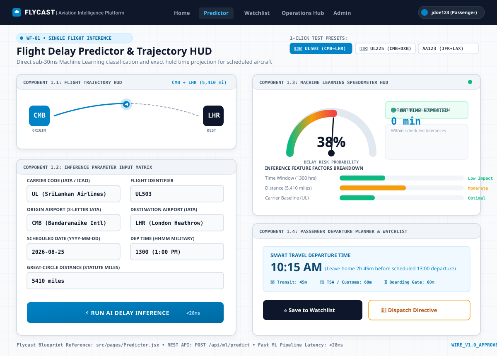
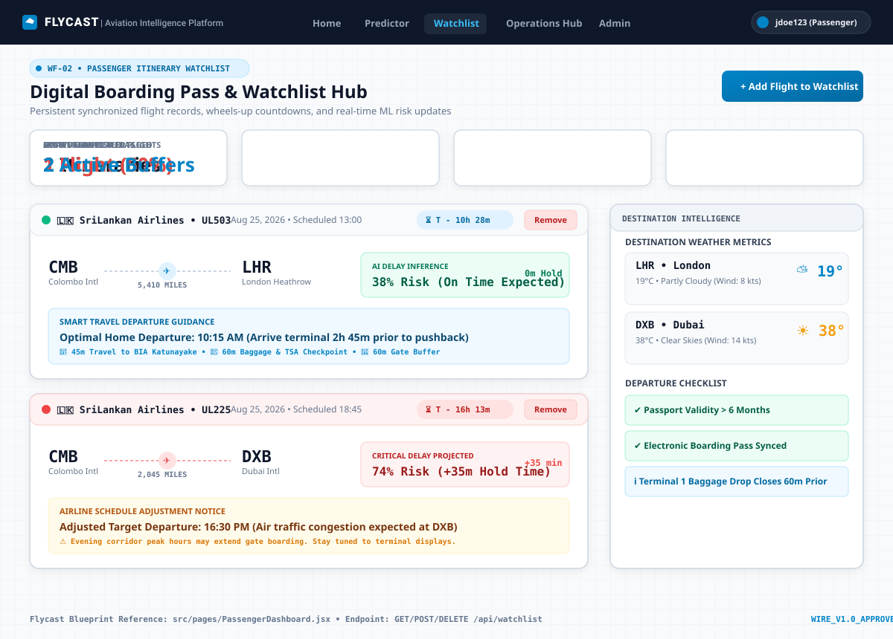
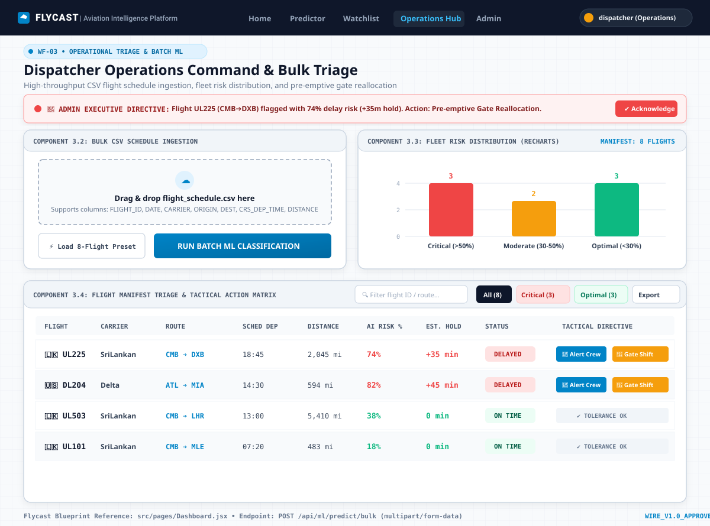
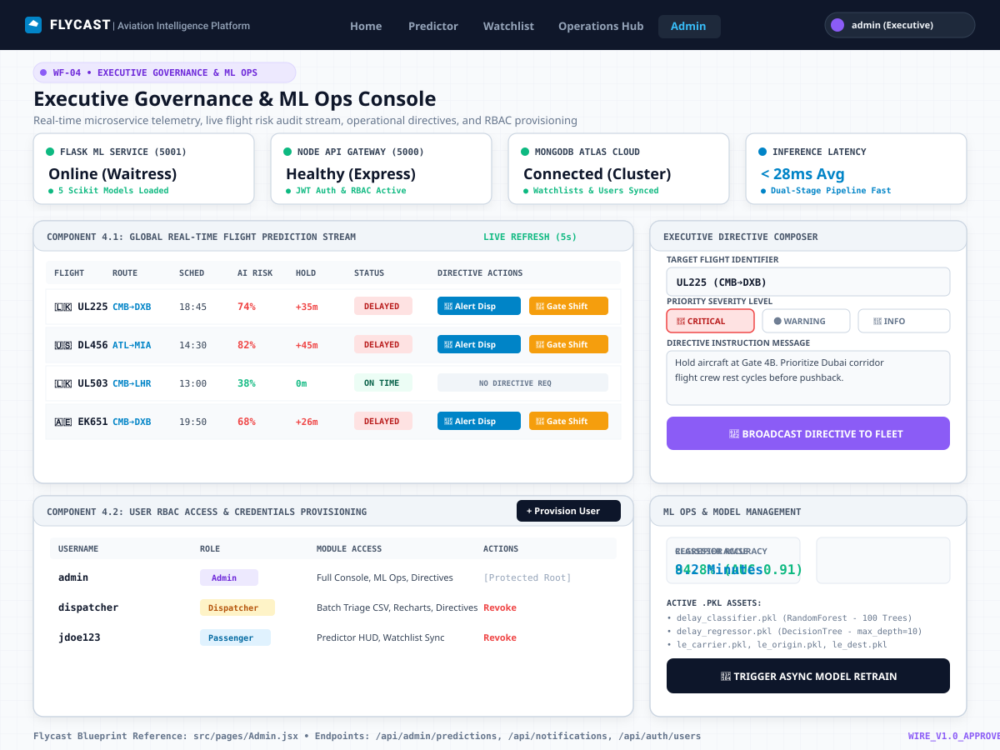
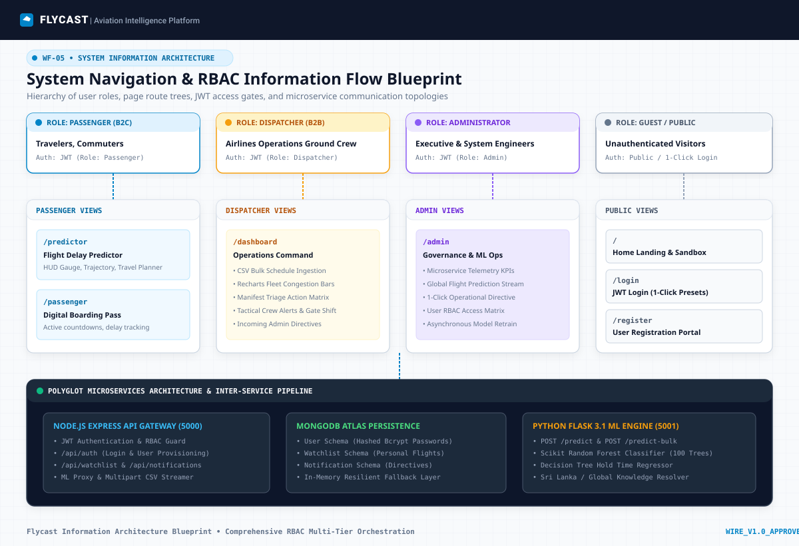
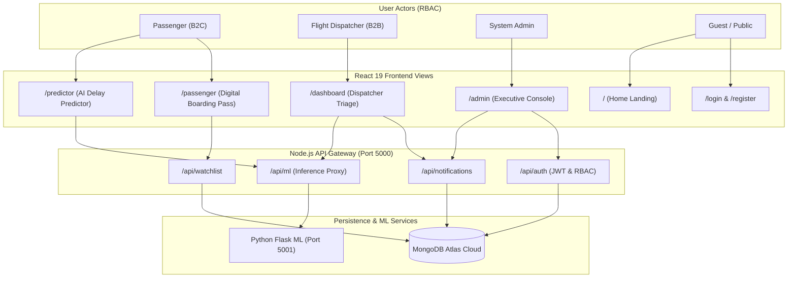
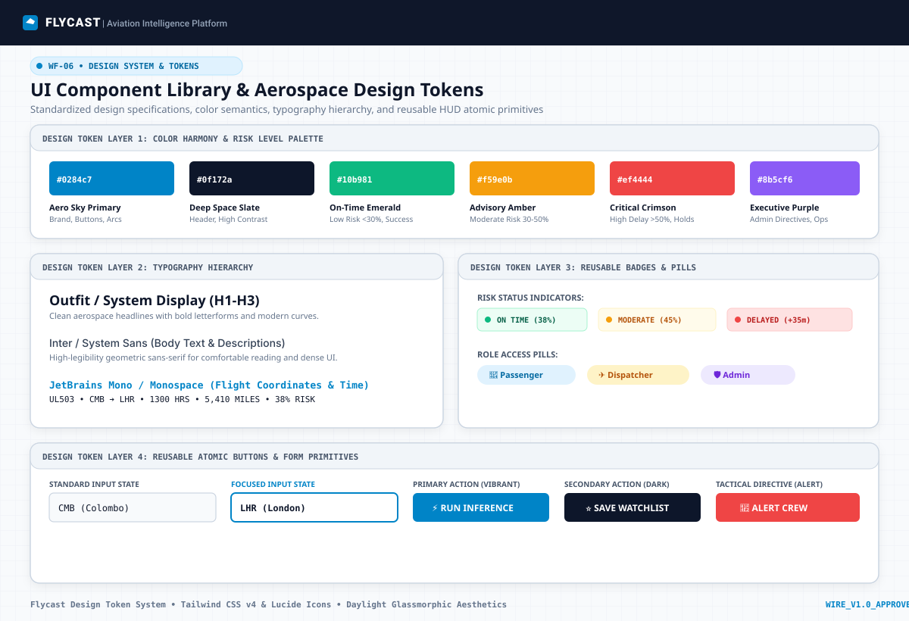

# 📐 Flycast UI/UX Wireframe Diagrams & Layout Blueprints

This directory contains the master architectural wireframe diagrams, component specifications, and interaction blueprints for the **Flycast Aviation Intelligence Platform**.

Each wireframe is provided as a standalone, resolution-independent **SVG vector blueprint** designed with aerospace technical schematics, clear component hierarchies, and exact field-level fidelity to the React 19 frontend implementation.

---

## 📑 Wireframe Catalog & Quick Navigation

| Wireframe ID | View / Screen | Target Route | Primary User Role | Vector Blueprint Link |
| :--- | :--- | :--- | :--- | :--- |
| **WF-01** | [Passenger Flight Predictor & Trajectory HUD](#1-wf-01--passenger-flight-delay-predictor--trajectory-hud) | `/predictor` | `Passenger`, `Operator` | [01_passenger_predictor_wireframe.svg](01_passenger_predictor_wireframe.svg) |
| **WF-02** | [Digital Boarding Pass & Personal Watchlist](#2-wf-02--digital-boarding-pass--passenger-watchlist) | `/passenger` | `Passenger` | [02_passenger_watchlist_wireframe.svg](02_passenger_watchlist_wireframe.svg) |
| **WF-03** | [Dispatcher Operations Command & Bulk Triage](#3-wf-03--dispatcher-operations-command--bulk-manifest-triage) | `/dashboard` | `Flight Dispatcher` | [03_dispatcher_dashboard_wireframe.svg](03_dispatcher_dashboard_wireframe.svg) |
| **WF-04** | [Executive Governance & ML Ops Console](#4-wf-04--executive-governance--ml-ops-console) | `/admin` | `System Administrator` | [04_admin_governance_wireframe.svg](04_admin_governance_wireframe.svg) |
| **WF-05** | [System Navigation & RBAC Information Flow](#5-wf-05--system-navigation--rbac-information-flow-blueprint) | Multi-Tier | `All Roles & Public` | [05_system_navigation_wireframe.svg](05_system_navigation_wireframe.svg) |
| **WF-06** | [UI Component Library & Aerospace Design Tokens](#6-wf-06--ui-component-library--aerospace-design-tokens) | Design System | `Frontend Developers` | [06_design_tokens_wireframe.svg](06_design_tokens_wireframe.svg) |

---

## 1. WF-01 • Passenger Flight Delay Predictor & Trajectory HUD

### Blueprint Overview
The Flight Delay Predictor provides a sub-30ms single-flight ML inference engine. It presents a split-column layout featuring an interactive parameter input form, an animated great-circle flight trajectory arc, an analog speedometer risk HUD gauge, factor contribution bars, and a smart travel departure advisor.

<div align="center">
  
</div>

### ASCII Layout Schematic
```text
+---------------------------------------------------------------------------------------------------------+
| [✈ FLYCAST]  Home   [Predictor]   Watchlist   Operations Hub   Admin                [jdoe123 (Passenger)] |
+---------------------------------------------------------------------------------------------------------+
| (WF-01) Flight Delay Predictor & Trajectory HUD                 1-Click: [UL503] [UL225] [AA123] [DL456] |
+----------------------------------------------------+----------------------------------------------------+
| COMPONENT 1.1: FLIGHT TRAJECTORY HUD               | COMPONENT 1.3: MACHINE LEARNING SPEEDOMETER HUD    |
| [CMB] ==== Great-Circle Arc (5,410 mi) ====> [LHR] |        .--.               [ON TIME EXPECTED]       |
|                                                    |      /  38% \             Hold: 0 min              |
|                                                    |     '--------'                                     |
| COMPONENT 1.2: INFERENCE PARAMETER FORM            | FEATURE IMPACT FACTORS BREAKDOWN:                  |
| - Carrier: [ UL (SriLankan Airlines) ]             | - Dep Time (1300 hrs) : [==========          ] Low |
| - Flight ID: [ UL503                 ]             | - Distance (5410 mi)  : [===============     ] Med |
| - Origin: [ CMB (Bandaranaike Intl)  ]             | - Carrier Profile     : [=======             ] Opt |
| - Dest:   [ LHR (London Heathrow)    ]             +----------------------------------------------------+
| - Date:   [ 2026-08-25 ] Time: [1300 ]             | COMPONENT 1.4: SMART TRAVEL PLANNER & ACTIONS      |
| - Great-Circle Distance: [ 5410 miles]             | Optimal Departure: 10:15 AM (Buffer: 2h 45m)       |
| [ ⚡ RUN AI DELAY INFERENCE (<28ms)  ]             | [ ⭐ Save to Watchlist ] [ 📢 Dispatch Directive ]  |
+----------------------------------------------------+----------------------------------------------------+
```

### Component Breakdown
1. **1-Click Test Presets Bar**: Instant selection of key Sri Lanka and international corridors (`UL503 CMB➔LHR`, `UL225 CMB➔DXB`, `UL101 CMB➔MLE`, `AA123 JFK➔LAX`, `DL456 ATL➔MIA`).
2. **Flight Trajectory HUD Canvas**: Visual representation of airport IATA nodes, great-circle distance in statute miles, and animated aircraft positioning.
3. **Inference Input Matrix**: Form fields validating Carrier, Origin, Destination, Date, Military Time (HHMM), and Distance.
4. **Machine Learning Speedometer**: Circular SVG speedometer gauge calculating delay probabilities from `<30%` (Optimal Emerald), `30-50%` (Advisory Amber), to `>50%` (Critical Crimson).
5. **Feature Factor Contribution**: Visual indicators breaking down how time of day, route distance, and airline carrier baseline influence the inference.
6. **Smart Travel Departure Advisor**: Backward time calculation factoring transit time (45m), airport security TSA/Customs buffer (60m), and boarding gate call (60m).
7. **Itinerary Actions**: Instant local/remote watchlist synchronization and role-gated admin directive triggers.

---

## 2. WF-02 • Digital Boarding Pass & Passenger Watchlist

### Blueprint Overview
The Passenger Watchlist console organizes saved flight itineraries in a high-contrast digital boarding pass format. It continuously synchronizes with local storage and MongoDB Atlas, computing real-time wheels-up countdown timers and localized destination weather briefings.

<div align="center">
  
</div>

### ASCII Layout Schematic
```text
+---------------------------------------------------------------------------------------------------------+
| [✈ FLYCAST]  Home   Predictor   [Watchlist]   Operations Hub   Admin                [jdoe123 (Passenger)] |
+---------------------------------------------------------------------------------------------------------+
| (WF-02) Digital Boarding Pass & Watchlist Hub                              [ + Add Flight to Watchlist ]|
+---------------------------------------------------------------------------------------------------------+
| [ ACTIVE: 2 Itineraries ]    [ ON-TIME: 1 Flight (50%) ]   [ HIGH RISK: 1 (50%) ]  [ SMART ALERTS: 2 ]  |
+-----------------------------------------------------------------------+---------------------------------+
| DIGITAL BOARDING PASS ITINERARY FEED                                  | DESTINATION INTELLIGENCE        |
|                                                                       |                                 |
| 🟢 SriLankan Airlines • UL503 (Aug 25, 2026 • 13:00) [T - 10h 28m]    | DESTINATION WEATHER:            |
|    CMB (Colombo) -------- (5,410 mi) --------> LHR (London)           | • LHR: ⛅ 19°C (Partly Cloudy)   |
|    AI Delay Inference: 38% Risk (On Time Expected • 0m Hold)          | • DXB: ☀️ 38°C (Clear Skies)    |
|    Guidance: Optimal Departure 10:15 AM (Arrive terminal 2h 45m prior)|                                 |
|                                                                       | DEPARTURE CHECKLIST:            |
| 🔴 SriLankan Airlines • UL225 (Aug 25, 2026 • 18:45) [T - 16h 13m]    | ✔ Passport Validity > 6 Months  |
|    CMB (Colombo) -------- (2,045 mi) --------> DXB (Dubai)            | ✔ Boarding Pass Synced          |
|    AI Delay Inference: 74% Risk (Critical Delay Projected • +35m Hold)| ℹ️ Bag Drop Closes 60m Prior    |
|    Notice: Adjusted Departure 16:30 PM (Air traffic congestion hold)  |                                 |
+-----------------------------------------------------------------------+---------------------------------+
```

### Component Breakdown
1. **Telemetry Top Ribbon**: High-level counters summarizing monitored flights, on-time percentage, critical risk items, and active buffer advisories.
2. **Boarding Pass Cards**: Dual-tier cards displaying carrier branding, route vectors, scheduled departure times, dynamic countdowns (`T - Xh Ym`), and delete triggers.
3. **Dynamic Risk Badges**: Color-coded probability indicators displaying exact hold durations generated by the regression model.
4. **Smart Travel Advisory Strip**: Dynamic departure time adjustments alerting passengers to leave earlier if traffic or gate congestion is projected.
5. **Destination Intelligence Sidebar**: Live destination weather telemetry (temperature, wind, condition icons) and standard airport pre-flight departure checklists.

---

## 3. WF-03 • Dispatcher Operations Command & Bulk Manifest Triage

### Blueprint Overview
The Dispatcher Operations Console empowers airline dispatchers to ingest bulk multi-flight manifests (CSV), trigger vectorized batch ML inferences, inspect fleet risk distribution charts via Recharts, and issue tactical crew directives.

<div align="center">
  
</div>

### ASCII Layout Schematic
```text
+---------------------------------------------------------------------------------------------------------+
| [✈ FLYCAST]  Home   Predictor   Watchlist   [Operations Hub]   Admin            [dispatcher (Operations)]|
+---------------------------------------------------------------------------------------------------------+
| 🔴 ADMIN EXECUTIVE DIRECTIVE: UL225 flagged with 74% delay risk (+35m hold).           [✔ Acknowledge]  |
+----------------------------------------------------+----------------------------------------------------+
| COMPONENT 3.2: BULK CSV SCHEDULE INGESTION         | COMPONENT 3.3: FLEET RISK DISTRIBUTION (RECHARTS)  |
| +------------------------------------------------+ |   Count                                            |
| | ☁ Drag & drop flight_schedule.csv here        | |    4 |                                               |
| +------------------------------------------------+ |    3 |  [###]                   [###]                |
| [ ⚡ Load 8-Flight Preset ] [ RUN BATCH ML TRIAGE ]|    2 |  [###]         [###]     [###]                |
|                                                    |    0 +--Critical-----Moderate---Optimal------------+
+----------------------------------------------------+----------------------------------------------------+
| COMPONENT 3.4: FLIGHT MANIFEST TRIAGE & TACTICAL ACTION MATRIX                                          |
| Search: [ 🔍 Filter flight ID / route... ]               Filters: [ All (8) ] [ Critical (3) ] [ Optimal (3) ]|
| FLIGHT   CARRIER   ROUTE       SCHED DEP   DISTANCE   AI RISK %   EST. HOLD   STATUS     TACTICAL ACTION|
| UL225    SriLankan CMB ➔ DXB   18:45       2,045 mi   74% 🔴      +35 min     DELAYED    [📢 Alert Crew] [🔄 Gate Shift] |
| DL204    Delta     ATL ➔ MIA   14:30       594 mi     82% 🔴      +45 min     DELAYED    [📢 Alert Crew] [🔄 Gate Shift] |
| UL503    SriLankan CMB ➔ LHR   13:00       5,410 mi   38% 🟢      0 min       ON TIME    [✔ TOLERANCE OK]               |
| UL101    SriLankan CMB ➔ MLE   07:20       483 mi     18% 🟢      0 min       ON TIME    [✔ TOLERANCE OK]               |
+---------------------------------------------------------------------------------------------------------+
```

### Component Breakdown
1. **Live Executive Directives Banner**: Immediate display of priority mandates broadcasted from the Administrator Console with a 1-click `Acknowledge` action.
2. **Bulk CSV Ingestion Dropzone**: Drag-and-drop container supporting arbitrary CSV files with pre-loaded 1-click sample manifests.
3. **Recharts Fleet Risk Distribution**: Interactive multi-bar visualization categorizing the entire manifest into Critical Risk (`>50%`), Moderate Risk (`30-50%`), and Optimal On-Time (`<30%`).
4. **Manifest Triage Data Matrix**: Sortable, filterable tabular display with real-time text query filtering, carrier logos, distance indicators, and status badges.
5. **Tactical Action Buttons**: 1-click operational triggers (`📢 Alert Crew`, `🔄 Gate Shift`, `⏱️ 30m Buffer`) that dispatch notifications across the platform.

---

## 4. WF-04 • Executive Governance & ML Ops Console

### Blueprint Overview
The Executive Governance & ML Ops Console is the central control room for system administrators. It combines microservice telemetry monitors, a live global flight prediction audit stream, a custom executive directive composer, user RBAC management, and asynchronous machine learning model hot-reloading.

<div align="center">
  
</div>

### ASCII Layout Schematic
```text
+---------------------------------------------------------------------------------------------------------+
| [✈ FLYCAST]  Home   Predictor   Watchlist   Operations Hub   [Admin]                   [admin (Executive)]|
+---------------------------------------------------------------------------------------------------------+
| (WF-04) Executive Governance & ML Ops Console                                                           |
+--------------------+--------------------+--------------------+------------------------------------------+
| FLASK ML (5001)    | NODE GATEWAY (5000)| MONGODB ATLAS      | INFERENCE LATENCY                        |
| Online (Waitress)  | Healthy (Express)  | Connected (Cloud)  | < 28ms Average                           |
| 5 Models Loaded    | JWT & RBAC Active  | Persisted Store    | Fast Dual Pipeline                       |
+--------------------+--------------------+--------------------+------------------------------------------+
| COMPONENT 4.1: GLOBAL FLIGHT PREDICTION STREAM     | COMPONENT 4.3: EXECUTIVE DIRECTIVE COMPOSER        |
| FLIGHT   ROUTE     SCHED   AI RISK  HOLD   STATUS  | Target Flight: [ UL225 (CMB➔DXB)                 ] |
| UL225    CMB➔DXB   18:45   74% 🔴   +35m   DELAYED | Priority: [ 🔴 CRITICAL ] [ 🟡 WARNING ] [ 🔵 INFO ]|
| DL456    ATL➔MIA   14:30   82% 🔴   +45m   DELAYED | Message: [ Hold aircraft at Gate 4B. Prioritize..] |
| UL503    CMB➔LHR   13:00   38% 🟢   0m     ON TIME | [ 📢 BROADCAST DIRECTIVE TO FLEET                ] |
| EK651    CMB➔DXB   19:50   68% 🔴   +26m   DELAYED +----------------------------------------------------+
+----------------------------------------------------+ COMPONENT 4.4: ML OPS & MODEL MANAGEMENT           |
| COMPONENT 4.2: USER RBAC ACCESS MATRIX             | Accuracy: 94.8% (AUC 0.91) | RMSE: 8.2 Minutes     |
| USERNAME   ROLE         MODULE ACCESS     ACTION   | Assets: delay_classifier.pkl, delay_regressor.pkl  |
| admin      Admin        Full Console      [Root]   | [ 🔄 TRIGGER ASYNC MODEL RETRAIN                 ] |
| dispatcher Dispatcher   Batch Triage, CSV [Revoke] |                                                    |
| jdoe123    Passenger    Predictor, Itin   [Revoke] |                                                    |
+----------------------------------------------------+----------------------------------------------------+
```

### Component Breakdown
1. **Microservice Telemetry KPIs**: Continuous heartbeat monitoring of Python Flask (Port 5001), Node.js Gateway (Port 5000), MongoDB Atlas, and sub-30ms inference response times.
2. **Global Real-Time Prediction Audit Stream**: Master log of all flight predictions evaluated across both passenger and dispatcher interfaces with immediate tactical broadcast actions.
3. **Executive Directive Broadcast Composer**: Multi-tier advisory composer allowing admins to formulate targeted instructions with severity badges (`🔴 CRITICAL`, `🟡 WARNING`, `🔵 INFO`) pushed to dispatchers.
4. **User RBAC Access Matrix**: Table of registered platform users with privilege levels, module access scopes, and account provisioning/revocation actions.
5. **ML Ops & Hot-Reload Console**: Real-time display of classifier accuracy (94.8%), regressor RMSE (8.2m), and a 1-click trigger to retrain Scikit-Learn models without server downtime.

---

## 5. WF-05 • System Navigation & RBAC Information Flow Blueprint

### Blueprint Overview
This architectural wireframe maps the multi-tier role-based access control (RBAC) hierarchy, routing pathways, API middleware guards, and polyglot inter-service communication flows across the entire platform.

<div align="center">
  
</div>

### Multi-Tier Navigation Matrix


---

## 6. WF-06 • UI Component Library & Aerospace Design Tokens

### Blueprint Overview
This design system blueprint documents the visual tokens, typography scales, glassmorphism layers, color semantics, and reusable atomic primitives used throughout Flycast.

<div align="center">
  
</div>

### Design Token Specifications

#### 1. Color Palette Tokens
| Token Name | Hex Code | Semantic Role |
| :--- | :--- | :--- |
| `--color-sky-primary` | `#0284c7` | Primary aviation blue, active trajectory arcs, primary CTA buttons |
| `--color-slate-space` | `#0f172a` | Deep aerospace slate, navigation bar, high-contrast dark buttons |
| `--color-emerald-ontime` | `#10b981` | Optimal on-time status (`<30%` risk), healthy system indicators |
| `--color-amber-warning` | `#f59e0b` | Moderate delay advisory (`30-50%` risk), gate shift directives |
| `--color-crimson-delayed`| `#ef4444` | High delay risk (`>50%` risk), positive hold minutes, critical directives |
| `--color-purple-executive`| `#8b5cf6` | Admin executive directives, governance badges, root privileges |

#### 2. Typography Scale
- **Headings (H1–H3)**: `Outfit`, `system-ui`, bold geometric curves.
- **Body & Captions**: `Inter`, `-apple-system`, optimized for dense tabular readability.
- **Data & Coordinates**: `JetBrains Mono`, `monospace`, used for flight IDs (`UL503`), military time (`1300`), distances (`5410 mi`), and risk probabilities (`38%`).

#### 3. Component Dimensions & Spacing
- **Container Max-Width**: `1280px` (`max-w-7xl`).
- **Standard Card Corner Radius**: `12px` (`rounded-xl` / `rounded-2xl`).
- **Standard Input Height**: `40px` (`h-10` with `rounded-lg`).
- **Button Padding**: `px-4 py-2.5` (`text-sm font-bold`).

---

## 🛠️ Developer Implementation Notes

All SVG wireframe files in this directory are standard standalone vector graphics. They can be:
- Previewed directly in any web browser or IDE SVG viewer.
- Rendered natively in GitHub Markdown documents.
- Imported into design tools like Figma, Sketch, or Adobe Illustrator.
- Maintained alongside the codebase to track UI changes across software releases.

```bash
# Directory layout
flycast/docs/wireframes/
├── 01_passenger_predictor_wireframe.svg
├── 02_passenger_watchlist_wireframe.svg
├── 03_dispatcher_dashboard_wireframe.svg
├── 04_admin_governance_wireframe.svg
├── 05_system_navigation_wireframe.svg
├── 06_design_tokens_wireframe.svg
└── README.md
```
